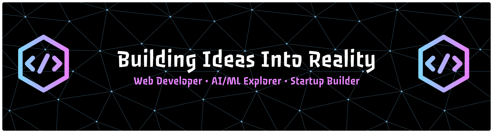

  

# Hi, I'm Khushi Rathod 👋

### Applied AI Engineer • AI/ML Researcher • Full-Stack Developer

I'm a second-year Computer Engineering student at **K. J. Somaiya Institute of Technology (KJSIT)** passionate about building intelligent systems that solve real-world problems.

My work lies at the intersection of **Artificial Intelligence, Computer Vision, Remote Sensing, Multi-Agent Systems, and Full-Stack Engineering**, where I transform research ideas into practical applications with measurable impact.

Currently, I'm:

* 🌾 Conducting AI research on satellite imagery for agricultural intelligence at **The AgriOrbit Technology**
* 📄 Working on a research paper on **Deep Learning for Paddy Stubble Burning Detection using Satellite Imagery**
* 🤖 Building intelligent AI systems using Computer Vision, NLP, LLMs, and Predictive Analytics
* 🚀 Exploring opportunities in AI/ML Research, Applied AI, and Full-Stack Engineering

---

# Areas of Interest

🧠 Artificial Intelligence

🤖 Machine Learning & Deep Learning

👁️ Computer Vision

🛰️ Remote Sensing & Geospatial AI

💬 Natural Language Processing

🌍 Multi-Agent AI Systems

📈 Predictive Analytics & Time-Series Forecasting

🌐 Full-Stack Development

---

# Tech Stack

### Languages

Python • C/C++ • Java • SQL • JavaScript • TypeScript • HTML • CSS

### AI / Machine Learning

TensorFlow • Keras • Scikit-learn • OpenCV • MediaPipe • NumPy • Pandas • Matplotlib • Google Earth Engine

### LLM & AI

Groq • Llama 3 • Gemini • BERT • Prompt Engineering

### Backend

FastAPI • Node.js • Express.js • Socket.io

### Frontend

React • Vite • Tailwind CSS • Next.js

### Database & Tools

Git • GitHub • VS Code • Jupyter Notebook • Fusion 360 • ANSYS • AutoCAD

---

# Featured Projects

## 🌾 AgriOrbit — AI for Precision Agriculture

Deep learning-based agricultural intelligence platform using multispectral satellite imagery and Google Earth Engine for paddy stubble-burning detection and environmental monitoring.

**Tech:** Python • TensorFlow • Google Earth Engine • Sentinel-2 • Remote Sensing

---

## 👁️ MotionQ — AI-Powered Assistive Technology

Hands-free human-computer interaction system enabling cursor control using eye tracking, facial gestures, and blink detection to improve digital accessibility.

🏆 Visionari'26 Winner • Copyright Registered • CIIA Evaluation Round

**Tech:** Python • OpenCV • MediaPipe • PyAutoGUI

---

## 🌍 Cascade — Multi-Agent AI Civilization Simulator

An AI-powered socio-economic simulation where autonomous LLM agents model the impact of automation, policy interventions, and economic disruptions using real-world datasets.

**Tech:** Groq • Llama 3 • React • Node.js • Socket.io

---

## 💭 Lumina — Emotion-Aware AI Companion

An intelligent conversational system that combines BERT-based emotion understanding, conversational memory, and emotional pattern visualization to help users understand their mental well-being.

🏅 HackCrux v2 Round 2 Shortlisted

**Tech:** BERT • NLP • React • Generative AI

---

## 🏥 MedPredict — AI Healthcare Intelligence Platform

Predictive healthcare platform for emergency admission forecasting, ICU bed demand prediction, staff workload analysis, and intelligent hospital resource allocation.

**Tech:** FastAPI • LSTM • Prophet • Random Forest • React

---

## 🔐 ProofLedger — Blockchain Ad Verification

Blockchain-powered escrow platform for secure digital advertising, transparent transactions, and verifiable proof-of-delivery.

**Tech:** Blockchain • Smart Contracts • React • Node.js

---

## 📊 AuditFlow Insights

AI-assisted audit intelligence platform for compliance monitoring, operational risk detection, and business analytics.

---

## 🚓 PreCrime

Machine learning-powered crime hotspot prediction system using spatiotemporal analytics and predictive modeling.

---

## 🚀 SpaceScope

Interactive platform integrating NASA APIs and 3D visualization to explore planetary data and scientific datasets.

---

## 🎮 Code of Silence

Interactive 3D mystery game developed for Renaissance TechFest, combining immersive storytelling, puzzle-solving, and modern web technologies.

---

# Achievements

🏆 Winner — Visionari'26 (MotionQ)

🥈 Second Place — TechnoGenesis Project Poster Competition

📄 MotionQ Copyright Registration

📄 Letter of Appreciation (MotionQ)

🛰️ AI/ML Intern — The AgriOrbit Technology

📚 Research Paper in Progress — Deep Learning for Paddy Stubble Burning Detection using Satellite Imagery

---

# Currently Exploring

* Efficient Deep Learning Models
* Vision-Language Models
* Geospatial AI
* Multi-Agent Systems
* Explainable AI
* AI for Agriculture
* AI for Healthcare
* Applied AI Research

---

# Connect With Me

💼 LinkedIn
https://www.linkedin.com/in/khushi-rathod-13b913348/

💻 GitHub
https://github.com/khushihr-coder

📧 Email
[rathodkhu23@gmail.com](mailto:rathodkhu23@gmail.com)

> *"Building AI that creates meaningful impact—one project, one experiment, and one research paper at a time."*

